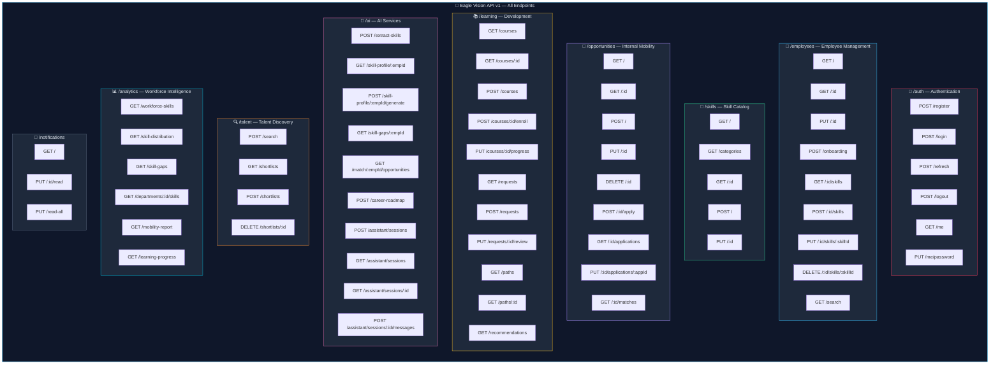
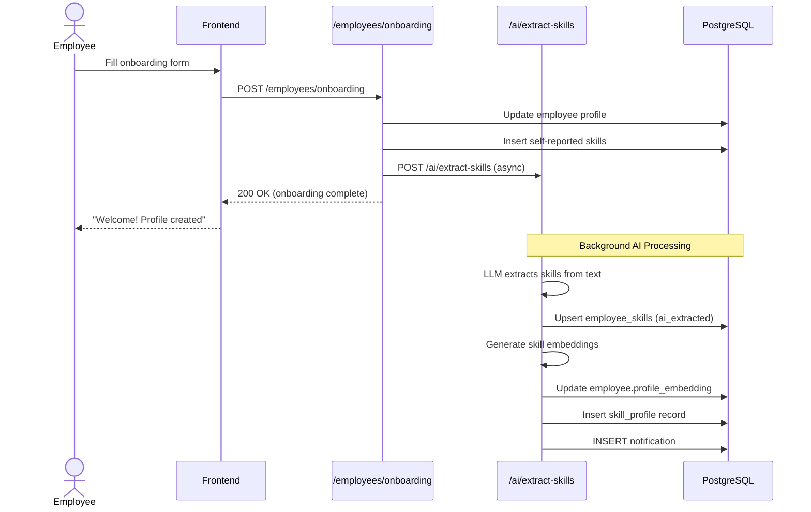
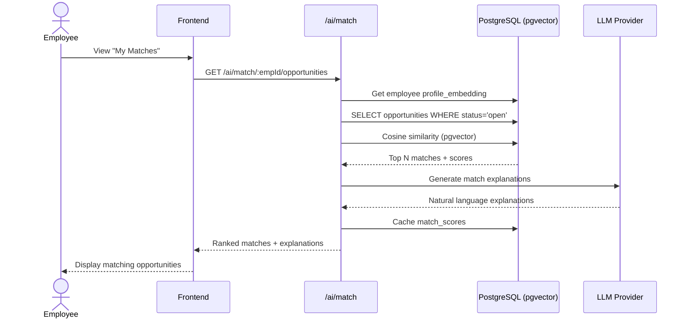
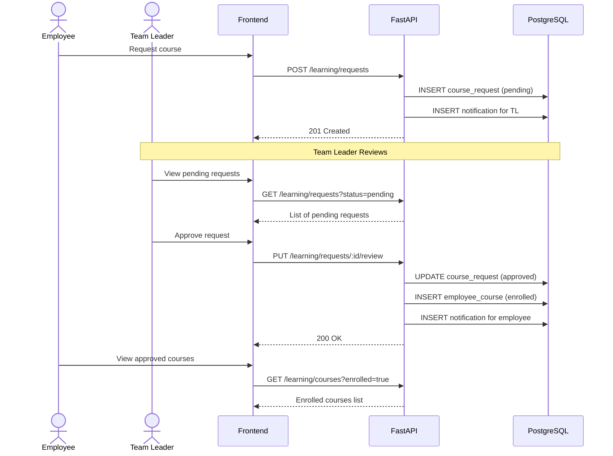

# Eagle Vision — API Design

> **Version:** 1.0  
> **Date:** 2026-09-19  
> **Status:** Draft — Pending Team Review  
> **Base URL:** `/api/v1`  
> **Format:** JSON  
> **Auth:** JWT Bearer Token (unless marked 🔓 Public)

---

## 1. API Architecture Overview

```mermaid
graph LR
    subgraph CLIENT["Client"]
        REACT["React App"]
    end

    subgraph API["REST API — /api/v1"]
        direction TB
        AUTH_R["/auth"]
        EMP_R["/employees"]
        SKILL_R["/skills"]
        OPP_R["/opportunities"]
        LEARN_R["/learning"]
        AI_R["/ai"]
        TALENT_R["/talent"]
        ANALYTICS_R["/analytics"]
        NOTIFY_R["/notifications"]
    end

    subgraph AUTH_LAYER["Auth Layer"]
        JWT["JWT Middleware"]
        RBAC["RBAC Guard"]
    end

    REACT -->|"HTTPS"| API
    API --> AUTH_LAYER
    AUTH_LAYER --> SERVICES["Service Layer"]
    SERVICES --> DB["PostgreSQL + pgvector"]

    style CLIENT fill:#1e293b,stroke:#38bdf8,color:#e2e8f0
    style API fill:#1e293b,stroke:#34d399,color:#e2e8f0
    style AUTH_LAYER fill:#1e293b,stroke:#f472b6,color:#e2e8f0
```



---

## 2. Standard Response Format

### Success Response

```json
{
  "success": true,
  "data": { ... },
  "message": "Operation successful",
  "meta": {
    "page": 1,
    "per_page": 20,
    "total": 150,
    "total_pages": 8
  }
}
```

### Error Response

```json
{
  "success": false,
  "error": {
    "code": "RESOURCE_NOT_FOUND",
    "message": "Employee not found",
    "details": [
      { "field": "employee_id", "message": "No employee with ID 'xxx'" }
    ]
  }
}
```

### Standard HTTP Status Codes

| Code | Usage |
|---|---|
| `200` | Success (GET, PUT) |
| `201` | Created (POST) |
| `204` | No Content (DELETE) |
| `400` | Bad Request / Validation Error |
| `401` | Unauthorized (missing/invalid token) |
| `403` | Forbidden (insufficient role) |
| `404` | Resource Not Found |
| `409` | Conflict (duplicate entry) |
| `422` | Unprocessable Entity (Pydantic validation) |
| `429` | Rate Limit Exceeded |
| `500` | Internal Server Error |

---

## 3. API Endpoint Map



---

## 4. Detailed API Specifications

---

### 4.1 🔐 Authentication — `/api/v1/auth`

#### `POST /auth/register` 🔓 Public

Register a new user account.

| Field | Type | Required | Notes |
|---|---|---|---|
| `email` | string | ✅ | Unique, valid email |
| `password` | string | ✅ | Min 8 chars, 1 uppercase, 1 number |
| `first_name` | string | ✅ | |
| `last_name` | string | ✅ | |
| `role` | enum | ✅ | `employee` \| `team_leader` \| `hr_manager` |
| `department_id` | uuid | ❌ | |

**Response:** `201 Created`
```json
{
  "success": true,
  "data": {
    "user": { "id": "uuid", "email": "...", "role": "employee" },
    "employee": { "id": "uuid", "first_name": "...", "last_name": "..." },
    "access_token": "eyJ...",
    "refresh_token": "eyJ...",
    "token_type": "bearer"
  }
}
```

---

#### `POST /auth/login` 🔓 Public

| Field | Type | Required |
|---|---|---|
| `email` | string | ✅ |
| `password` | string | ✅ |

**Response:** `200 OK`
```json
{
  "success": true,
  "data": {
    "user": { "id": "uuid", "email": "...", "role": "employee" },
    "access_token": "eyJ...",
    "refresh_token": "eyJ...",
    "token_type": "bearer",
    "expires_in": 900
  }
}
```

---

#### `POST /auth/refresh`

| Field | Type | Required |
|---|---|---|
| `refresh_token` | string | ✅ |

**Response:** `200 OK` → New `access_token`

---

#### `POST /auth/logout`

Invalidates the refresh token.

**Response:** `204 No Content`

---

#### `GET /auth/me`

Returns the authenticated user's profile.

**Response:** `200 OK` → Full user + employee profile

---

#### `PUT /auth/me/password`

| Field | Type | Required |
|---|---|---|
| `current_password` | string | ✅ |
| `new_password` | string | ✅ |

**Response:** `200 OK`

---

### 4.2 👤 Employees — `/api/v1/employees`

#### `GET /employees` — 🔒 HR Only

List all employees with filtering and pagination.

**Query Parameters:**

| Param | Type | Default | Notes |
|---|---|---|---|
| `page` | int | 1 | |
| `per_page` | int | 20 | Max 100 |
| `department_id` | uuid | — | Filter by department |
| `search` | string | — | Search name/email |
| `onboarding_status` | enum | — | Filter by status |
| `sort_by` | string | `created_at` | `name`, `department`, `created_at` |
| `order` | enum | `desc` | `asc` \| `desc` |

**Response:** `200 OK` → Paginated employee list

---

#### `GET /employees/:id` — 🔒 Self / TL (team) / HR

**Response:** `200 OK`
```json
{
  "success": true,
  "data": {
    "id": "uuid",
    "first_name": "John",
    "last_name": "Doe",
    "email": "john@company.com",
    "department": { "id": "uuid", "name": "Engineering" },
    "designation": "Senior Developer",
    "bio": "...",
    "years_of_experience": 5,
    "onboarding_status": "completed",
    "skills": [
      {
        "id": "uuid",
        "name": "Python",
        "proficiency": "advanced",
        "source": "ai_extracted",
        "confidence_score": 0.92
      }
    ],
    "career_goals": "...",
    "date_of_joining": "2024-01-15",
    "created_at": "2024-01-15T10:00:00Z"
  }
}
```

---

#### `PUT /employees/:id` — 🔒 Self / HR

Update employee profile.

| Field | Type | Notes |
|---|---|---|
| `first_name` | string | |
| `last_name` | string | |
| `phone` | string | |
| `designation` | string | |
| `bio` | text | |
| `interests` | text | |
| `career_goals` | text | |
| `years_of_experience` | int | |

---

#### `POST /employees/onboarding` — 🔒 Self

Complete onboarding with initial professional information.

| Field | Type | Required | Notes |
|---|---|---|---|
| `designation` | string | ✅ | |
| `bio` | text | ❌ | |
| `interests` | text | ❌ | |
| `career_goals` | text | ❌ | |
| `years_of_experience` | int | ✅ | |
| `skills` | array | ✅ | `[{ name, proficiency }]` |
| `work_experiences` | array | ❌ | `[{ company, role, description, start, end }]` |

**Response:** `200 OK` → Updated employee + triggers AI skill extraction

---

#### `GET /employees/:id/skills` — 🔒 Self / TL (team) / HR

**Response:** `200 OK` → List of `employee_skills` with skill details

---

#### `POST /employees/:id/skills` — 🔒 Self

Add a new skill.

| Field | Type | Required |
|---|---|---|
| `skill_id` | uuid | ✅ |
| `proficiency` | enum | ✅ |

---

#### `PUT /employees/:id/skills/:skillId` — 🔒 Self

Update proficiency level.

---

#### `DELETE /employees/:id/skills/:skillId` — 🔒 Self

Remove a self-reported skill.

---

#### `GET /employees/search` — 🔒 TL / HR

Search employees by skills and capabilities.

| Param | Type | Notes |
|---|---|---|
| `skills` | string | Comma-separated skill names or IDs |
| `min_proficiency` | enum | Minimum proficiency filter |
| `department_id` | uuid | |
| `semantic_query` | string | Free-text semantic search (pgvector) |
| `page` | int | |
| `per_page` | int | |

---

### 4.3 🎯 Skills — `/api/v1/skills`

#### `GET /skills` — 🔒 Any Authenticated

List all skills with optional category filter.

| Param | Type | Notes |
|---|---|---|
| `category_id` | uuid | Filter by category |
| `search` | string | Search by name |

---

#### `GET /skills/categories` — 🔒 Any Authenticated

List all skill categories.

---

#### `GET /skills/:id` — 🔒 Any Authenticated

Get skill details.

---

#### `POST /skills` — 🔒 HR Only

Create a new skill in the catalog.

| Field | Type | Required |
|---|---|---|
| `name` | string | ✅ |
| `description` | text | ❌ |
| `category_id` | uuid | ✅ |

---

#### `PUT /skills/:id` — 🔒 HR Only

Update skill details.

---

### 4.4 🚀 Opportunities — `/api/v1/opportunities`

#### `GET /opportunities` — 🔒 Any Authenticated

List opportunities with filters.

| Param | Type | Notes |
|---|---|---|
| `status` | enum | `draft` \| `open` \| `closed` \| `filled` |
| `type` | enum | `role` \| `project` \| `secondment` \| `mentorship` |
| `department_id` | uuid | |
| `search` | string | |
| `page` | int | |
| `per_page` | int | |

**Employee view:** Only `open` opportunities.  
**TL view:** Own department + `open`.  
**HR view:** All opportunities.

---

#### `GET /opportunities/:id` — 🔒 Any Authenticated

Full opportunity details including required skills.

```json
{
  "success": true,
  "data": {
    "id": "uuid",
    "title": "Senior Backend Developer",
    "description": "...",
    "type": "role",
    "status": "open",
    "department": { "id": "uuid", "name": "Engineering" },
    "created_by": { "id": "uuid", "name": "Jane HR" },
    "required_skills": [
      {
        "skill": { "id": "uuid", "name": "Python" },
        "importance": "required",
        "min_proficiency": "advanced"
      },
      {
        "skill": { "id": "uuid", "name": "FastAPI" },
        "importance": "preferred",
        "min_proficiency": "intermediate"
      }
    ],
    "deadline": "2026-12-01",
    "created_at": "2026-09-01T10:00:00Z"
  }
}
```

---

#### `POST /opportunities` — 🔒 TL / HR

Create an internal opportunity.

| Field | Type | Required |
|---|---|---|
| `title` | string | ✅ |
| `description` | text | ✅ |
| `type` | enum | ✅ |
| `department_id` | uuid | ✅ |
| `requirements_text` | text | ✅ |
| `deadline` | date | ❌ |
| `required_skills` | array | ✅ |

`required_skills` format:
```json
[
  { "skill_id": "uuid", "importance": "required", "min_proficiency": "advanced" },
  { "skill_id": "uuid", "importance": "preferred", "min_proficiency": "intermediate" }
]
```

**Side effect:** Generates `requirements_embedding` via AI pipeline.

---

#### `PUT /opportunities/:id` — 🔒 Creator / HR

Update opportunity details.

---

#### `DELETE /opportunities/:id` — 🔒 Creator / HR

Soft-delete (set status to `closed`).

---

#### `POST /opportunities/:id/apply` — 🔒 Employee Only

Express interest in an opportunity.

| Field | Type | Required |
|---|---|---|
| `cover_note` | text | ❌ |

**Side effect:** Triggers AI match scoring.

**Response:** `201 Created`
```json
{
  "success": true,
  "data": {
    "application_id": "uuid",
    "status": "applied",
    "match_score": 78.5,
    "match_explanation": "Strong alignment in Python and API development..."
  }
}
```

---

#### `GET /opportunities/:id/applications` — 🔒 Creator / HR

List all applications for an opportunity.

---

#### `PUT /opportunities/:id/applications/:appId` — 🔒 Creator / HR

Update application status.

| Field | Type | Required |
|---|---|---|
| `status` | enum | ✅ |
| `notes` | text | ❌ |

Status transitions: `applied` → `under_review` → `shortlisted` / `rejected` → `accepted`

---

#### `GET /opportunities/:id/matches` — 🔒 Creator / HR

Get AI-generated best-match employees for this opportunity.

---

### 4.5 📚 Learning — `/api/v1/learning`

#### `GET /learning/courses` — 🔒 Any Authenticated

| Param | Type | Notes |
|---|---|---|
| `difficulty` | enum | |
| `provider` | string | |
| `search` | string | |
| `skill_id` | uuid | Courses covering this skill |

---

#### `GET /learning/courses/:id` — 🔒 Any Authenticated

---

#### `POST /learning/courses` — 🔒 HR Only

Add a new course to the catalog.

---

#### `POST /learning/courses/:id/enroll` — 🔒 Employee

Enroll in a course.

---

#### `PUT /learning/courses/:id/progress` — 🔒 Employee

Update course progress.

| Field | Type | Required |
|---|---|---|
| `progress_percent` | int | ✅ |
| `status` | enum | ❌ |

---

#### `GET /learning/requests` — 🔒 Self / TL (team) / HR

List course requests.

**Employee:** Own requests.  
**TL:** Team member requests.  
**HR:** All requests.

---

#### `POST /learning/requests` — 🔒 Employee

Request a new course.

| Field | Type | Required |
|---|---|---|
| `course_id` | uuid | ✅ |
| `justification` | text | ✅ |

---

#### `PUT /learning/requests/:id/review` — 🔒 TL / HR

Approve or reject a course request.

| Field | Type | Required |
|---|---|---|
| `status` | enum | ✅ |
| `review_notes` | text | ❌ |

---

#### `GET /learning/paths` — 🔒 Employee (own)

Get the employee's learning paths.

---

#### `GET /learning/paths/:id` — 🔒 Self / HR

Get detailed learning path with items.

---

#### `GET /learning/recommendations` — 🔒 Employee (own)

Get AI-generated learning recommendations based on current skill gaps.

---

### 4.6 🧠 AI Services — `/api/v1/ai`

#### `POST /ai/extract-skills` — 🔒 System / HR

Trigger skill extraction from employee profile text.

| Field | Type | Required |
|---|---|---|
| `employee_id` | uuid | ✅ |
| `text` | text | ✅ |

**Response:** `200 OK`
```json
{
  "success": true,
  "data": {
    "extracted_skills": [
      {
        "name": "Python",
        "category": "Technical",
        "proficiency": "advanced",
        "confidence": 0.95,
        "evidence": "5 years building FastAPI microservices"
      },
      {
        "name": "Team Leadership",
        "category": "Soft Skills",
        "proficiency": "intermediate",
        "confidence": 0.78,
        "evidence": "Led a team of 3 developers",
        "is_transferable": true
      }
    ]
  }
}
```

---

#### `GET /ai/skill-profile/:empId` — 🔒 Self / TL (team) / HR

Get the latest AI-generated skill profile.

**Response:** `200 OK`
```json
{
  "success": true,
  "data": {
    "employee_id": "uuid",
    "skill_summary": "Full-stack developer with strong backend expertise...",
    "top_skills": ["Python", "FastAPI", "PostgreSQL", "React"],
    "transferable_skills": ["Project Management", "Technical Writing"],
    "overall_score": 82,
    "generated_at": "2026-09-15T10:00:00Z"
  }
}
```

---

#### `POST /ai/skill-profile/:empId/generate` — 🔒 Self / HR

Re-generate the AI skill profile (forces fresh analysis).

---

#### `GET /ai/skill-gaps/:empId` — 🔒 Self / TL (team) / HR

| Param | Type | Notes |
|---|---|---|
| `target_opportunity_id` | uuid | Compare against opportunity requirements |
| `target_role` | string | Or free-text target role |

**Response:** `200 OK`
```json
{
  "success": true,
  "data": {
    "employee_id": "uuid",
    "target": "Senior Backend Developer",
    "gaps": [
      {
        "skill": "Kubernetes",
        "current_level": "none",
        "required_level": "intermediate",
        "priority": "high",
        "recommendation": "Complete CKA certification course"
      },
      {
        "skill": "System Design",
        "current_level": "beginner",
        "required_level": "advanced",
        "priority": "critical",
        "recommendation": "Study distributed systems patterns"
      }
    ],
    "gap_score": 35,
    "readiness_percent": 65
  }
}
```

---

#### `GET /ai/match/:empId/opportunities` — 🔒 Self

Find matching opportunities for the employee.

**Response:** `200 OK`
```json
{
  "success": true,
  "data": {
    "matches": [
      {
        "opportunity": { "id": "uuid", "title": "Backend Lead" },
        "match_score": 87.5,
        "explanation": "Strong Python and leadership skills align...",
        "matching_skills": ["Python", "FastAPI", "Leadership"],
        "missing_skills": ["Kubernetes"]
      }
    ]
  }
}
```

---

#### `POST /ai/career-roadmap` — 🔒 Employee

Generate a personalized career development roadmap.

| Field | Type | Required |
|---|---|---|
| `target_opportunity_id` | uuid | ❌ |
| `target_role` | string | ❌ |
| `timeframe_months` | int | ❌ |

**Response:** `201 Created` → Full learning path with ordered items

---

#### `POST /ai/assistant/sessions` — 🔒 Employee (career) / HR (talent)

Start a new AI assistant chat session.

| Field | Type | Required |
|---|---|---|
| `assistant_type` | enum | ✅ |

`career` = Employee AI Career Assistant  
`talent` = HR AI Talent Assistant

---

#### `GET /ai/assistant/sessions` — 🔒 Self

List own chat sessions.

---

#### `GET /ai/assistant/sessions/:id` — 🔒 Self

Get session with full message history.

---

#### `POST /ai/assistant/sessions/:id/messages` — 🔒 Self

Send a message and receive AI response.

| Field | Type | Required |
|---|---|---|
| `content` | text | ✅ |

**Response:** `200 OK`
```json
{
  "success": true,
  "data": {
    "user_message": {
      "id": "uuid",
      "role": "user",
      "content": "What skills do I need for a product manager role?"
    },
    "assistant_message": {
      "id": "uuid",
      "role": "assistant",
      "content": "Based on your current profile as a Senior Developer..."
    }
  }
}
```

---

### 4.7 🔍 Talent Discovery — `/api/v1/talent`

#### `POST /talent/search` — 🔒 TL / HR

Advanced talent search with semantic matching.

| Field | Type | Required | Notes |
|---|---|---|---|
| `query` | string | ❌ | Free-text semantic search |
| `skills` | array | ❌ | `[{ skill_id, min_proficiency }]` |
| `department_id` | uuid | ❌ | |
| `min_experience` | int | ❌ | Years |
| `page` | int | ❌ | |
| `per_page` | int | ❌ | |

**Response:** `200 OK` → Ranked list of matching employees with similarity scores

---

#### `GET /talent/shortlists` — 🔒 TL / HR

List shortlists created by the current user.

---

#### `POST /talent/shortlists` — 🔒 TL / HR

Add an employee to a shortlist.

| Field | Type | Required |
|---|---|---|
| `opportunity_id` | uuid | ✅ |
| `employee_id` | uuid | ✅ |
| `notes` | text | ❌ |
| `rank` | int | ❌ |

---

#### `DELETE /talent/shortlists/:id` — 🔒 Creator / HR

Remove from shortlist.

---

### 4.8 📊 Analytics — `/api/v1/analytics`

#### `GET /analytics/workforce-skills` — 🔒 HR Only

Organization-wide skill distribution overview.

**Response:** `200 OK`
```json
{
  "success": true,
  "data": {
    "total_employees": 250,
    "total_unique_skills": 85,
    "top_skills": [
      { "skill": "Python", "employee_count": 45, "avg_proficiency": "intermediate" },
      { "skill": "JavaScript", "employee_count": 38, "avg_proficiency": "advanced" }
    ],
    "skills_by_category": {
      "Technical": 120,
      "Soft Skills": 45,
      "Domain Knowledge": 30,
      "Tools": 40
    }
  }
}
```

---

#### `GET /analytics/skill-distribution` — 🔒 HR Only

| Param | Type | Notes |
|---|---|---|
| `group_by` | enum | `category` \| `department` \| `proficiency` |

---

#### `GET /analytics/skill-gaps` — 🔒 HR Only

Organization-wide skill gap analysis.

---

#### `GET /analytics/departments/:id/skills` — 🔒 HR / TL (own dept)

Department-level skill breakdown.

---

#### `GET /analytics/mobility-report` — 🔒 HR Only

Internal mobility metrics.

```json
{
  "success": true,
  "data": {
    "open_opportunities": 12,
    "total_applications": 45,
    "successful_moves": 8,
    "avg_match_score": 72.3,
    "top_source_departments": ["Engineering", "Product"],
    "most_requested_skills": ["Python", "Data Analysis"]
  }
}
```

---

#### `GET /analytics/learning-progress` — 🔒 HR Only

Learning & development metrics across the organization.

---

### 4.9 🔔 Notifications — `/api/v1/notifications`

#### `GET /notifications` — 🔒 Self

| Param | Type | Notes |
|---|---|---|
| `is_read` | bool | Filter read/unread |
| `type` | enum | Filter by type |
| `page` | int | |
| `per_page` | int | |

---

#### `PUT /notifications/:id/read` — 🔒 Self

Mark a notification as read.

---

#### `PUT /notifications/read-all` — 🔒 Self

Mark all notifications as read.

---

## 5. API Flow Diagrams

### 5.1 Employee Onboarding → AI Profile Generation



### 5.2 Opportunity Matching Flow



### 5.3 Course Approval Workflow



---

## 6. Rate Limiting

| Endpoint Group | Limit | Window |
|---|---|---|
| `/auth/login`, `/auth/register` | 10 requests | per minute |
| `/ai/*` (AI processing) | 20 requests | per minute |
| `/ai/assistant/*/messages` | 30 requests | per minute |
| All other authenticated endpoints | 100 requests | per minute |

---

## 7. API Versioning Strategy

| Version | Path | Status |
|---|---|---|
| v1 | `/api/v1/*` | Active (Current) |
| v2 | `/api/v2/*` | Future |

- All breaking changes require a new API version.
- Non-breaking additions (new fields, new endpoints) are added to the current version.
- Deprecated endpoints return `Deprecation` header with sunset date.
