# Eagle Vision — Database Design

> **Version:** 1.0  
> **Date:** 2026-09-19  
> **Status:** Draft — Pending Team Review  
> **Database:** PostgreSQL 16 + pgvector extension

---

## 1. Entity Relationship Diagram (ERD)

```mermaid
erDiagram
    users ||--o| employees : "has profile"
    users {
        uuid id PK
        varchar email UK
        varchar password_hash
        enum role "employee | team_leader | hr_manager"
        boolean is_active
        timestamp created_at
        timestamp updated_at
    }

    employees ||--o{ employee_skills : "has"
    employees ||--o{ work_experiences : "has"
    employees ||--o{ employee_projects : "works on"
    employees ||--o{ employee_courses : "enrolled in"
    employees ||--o{ course_requests : "requests"
    employees ||--o{ opportunity_applications : "applies to"
    employees ||--o{ skill_profiles : "has AI profile"
    employees ||--o{ skill_gaps : "has gaps"
    employees ||--o{ learning_paths : "follows"
    employees ||--o{ chat_sessions : "chats with AI"
    employees ||--o{ notifications : "receives"
    employees {
        uuid id PK
        uuid user_id FK
        uuid department_id FK
        varchar first_name
        varchar last_name
        varchar phone
        varchar designation
        text bio
        text interests
        text career_goals
        integer years_of_experience
        date date_of_joining
        enum onboarding_status "pending | in_progress | completed"
        vector profile_embedding "pgvector 768d"
        timestamp created_at
        timestamp updated_at
    }

    departments ||--o{ employees : "contains"
    departments {
        uuid id PK
        varchar name UK
        varchar description
        uuid head_id FK "team_leader user"
        timestamp created_at
    }

    skills ||--o{ employee_skills : "assigned to"
    skills ||--o{ opportunity_skills : "required by"
    skills ||--o{ skill_gaps : "gap in"
    skills {
        uuid id PK
        varchar name UK
        text description
        uuid category_id FK
        vector embedding "pgvector 768d"
        timestamp created_at
    }

    skill_categories ||--o{ skills : "groups"
    skill_categories {
        uuid id PK
        varchar name UK "Technical | Soft | Domain | Tools"
        varchar description
    }

    employee_skills {
        uuid id PK
        uuid employee_id FK
        uuid skill_id FK
        enum proficiency "beginner | intermediate | advanced | expert"
        enum source "self_reported | ai_extracted | verified | project"
        float confidence_score "0.0 to 1.0"
        boolean is_transferable
        timestamp assessed_at
        timestamp created_at
    }

    work_experiences {
        uuid id PK
        uuid employee_id FK
        varchar company
        varchar role_title
        text description
        text skills_used
        date start_date
        date end_date
        boolean is_current
        timestamp created_at
    }

    projects ||--o{ employee_projects : "staffed with"
    projects {
        uuid id PK
        varchar name
        text description
        uuid department_id FK
        uuid lead_id FK "team_leader"
        enum status "active | completed | on_hold"
        date start_date
        date end_date
        timestamp created_at
    }

    employee_projects {
        uuid id PK
        uuid employee_id FK
        uuid project_id FK
        varchar role_in_project
        text contributions
        date start_date
        date end_date
        timestamp created_at
    }

    courses ||--o{ employee_courses : "enrolled by"
    courses ||--o{ course_requests : "requested"
    courses {
        uuid id PK
        varchar title
        text description
        varchar provider "Udemy | Coursera | Internal"
        varchar url
        enum difficulty "beginner | intermediate | advanced"
        text skills_covered "JSON array of skill names"
        integer duration_hours
        boolean is_active
        timestamp created_at
    }

    employee_courses {
        uuid id PK
        uuid employee_id FK
        uuid course_id FK
        enum status "enrolled | in_progress | completed | dropped"
        integer progress_percent "0-100"
        date enrolled_at
        date completed_at
        timestamp created_at
    }

    course_requests {
        uuid id PK
        uuid employee_id FK
        uuid course_id FK
        text justification
        enum status "pending | approved | rejected"
        uuid reviewed_by FK "team_leader or hr"
        text review_notes
        timestamp requested_at
        timestamp reviewed_at
    }

    opportunities ||--o{ opportunity_skills : "requires"
    opportunities ||--o{ opportunity_applications : "receives"
    opportunities ||--o{ talent_shortlists : "shortlisted for"
    opportunities {
        uuid id PK
        varchar title
        text description
        uuid department_id FK
        uuid created_by FK "hr or team_leader"
        enum type "role | project | secondment | mentorship"
        enum status "draft | open | closed | filled"
        text requirements_text
        vector requirements_embedding "pgvector 768d"
        date deadline
        timestamp created_at
        timestamp updated_at
    }

    opportunity_skills {
        uuid id PK
        uuid opportunity_id FK
        uuid skill_id FK
        enum importance "required | preferred | nice_to_have"
        enum min_proficiency "beginner | intermediate | advanced | expert"
    }

    opportunity_applications {
        uuid id PK
        uuid employee_id FK
        uuid opportunity_id FK
        text cover_note
        enum status "applied | under_review | shortlisted | accepted | rejected"
        float match_score "0-100 AI generated"
        text match_explanation "AI generated"
        timestamp applied_at
        timestamp updated_at
    }

    talent_shortlists {
        uuid id PK
        uuid opportunity_id FK
        uuid employee_id FK
        uuid shortlisted_by FK "team_leader or hr"
        text notes
        integer rank
        timestamp created_at
    }

    skill_profiles {
        uuid id PK
        uuid employee_id FK
        jsonb extracted_skills "Full AI output"
        jsonb transferable_skills "Cross-domain skills"
        jsonb skill_summary "Natural language summary"
        float overall_score "0-100"
        timestamp generated_at
        timestamp created_at
    }

    skill_gaps {
        uuid id PK
        uuid employee_id FK
        uuid target_opportunity_id FK "nullable"
        varchar target_role "nullable — free text target"
        uuid skill_id FK
        enum current_level "none | beginner | intermediate | advanced"
        enum required_level "beginner | intermediate | advanced | expert"
        enum priority "critical | high | medium | low"
        text recommendation
        timestamp analyzed_at
    }

    learning_paths ||--o{ learning_path_items : "contains"
    learning_paths {
        uuid id PK
        uuid employee_id FK
        varchar title
        text description
        uuid target_opportunity_id FK "nullable"
        varchar target_role "nullable"
        enum status "active | completed | abandoned"
        jsonb ai_roadmap "Full AI-generated roadmap"
        timestamp created_at
        timestamp updated_at
    }

    learning_path_items {
        uuid id PK
        uuid learning_path_id FK
        uuid course_id FK "nullable"
        uuid skill_id FK
        varchar title
        text description
        integer sequence_order
        enum status "pending | in_progress | completed"
        enum type "course | project | reading | practice | mentorship"
        timestamp completed_at
    }

    match_scores {
        uuid id PK
        uuid employee_id FK
        uuid opportunity_id FK
        float overall_score "0-100"
        jsonb skill_breakdown "per-skill match detail"
        text explanation "AI-generated"
        timestamp computed_at
    }

    chat_sessions ||--o{ chat_messages : "contains"
    chat_sessions {
        uuid id PK
        uuid employee_id FK
        enum assistant_type "career | talent"
        varchar title
        jsonb context_snapshot "skills, gaps, profile at time of chat"
        timestamp created_at
        timestamp last_message_at
    }

    chat_messages {
        uuid id PK
        uuid session_id FK
        enum role "user | assistant | system"
        text content
        jsonb metadata "token count, model, latency"
        timestamp created_at
    }

    notifications {
        uuid id PK
        uuid user_id FK
        varchar title
        text message
        enum type "info | success | warning | action_required"
        varchar action_url "nullable"
        boolean is_read
        timestamp created_at
    }

    audit_logs {
        uuid id PK
        uuid user_id FK
        varchar action "create | update | delete | login | export"
        varchar resource_type
        uuid resource_id "nullable"
        jsonb old_value "nullable"
        jsonb new_value "nullable"
        varchar ip_address
        timestamp created_at
    }
```



---

## 2. Table Summary

| # | Table | Purpose | Key Relations |
|---|---|---|---|
| 1 | `users` | Authentication & login credentials | Base for all roles |
| 2 | `employees` | Employee profiles, onboarding, career info | 1:1 with `users` |
| 3 | `departments` | Organizational units | Has employees, projects, opportunities |
| 4 | `skills` | Master skill catalog / taxonomy | Referenced everywhere |
| 5 | `skill_categories` | Skill groupings (Technical, Soft, Domain, Tools) | Groups skills |
| 6 | `employee_skills` | Junction — employee ↔ skill + proficiency | Many-to-many |
| 7 | `work_experiences` | Prior work history entries | Belongs to employee |
| 8 | `projects` | Company projects | Has department, lead, team members |
| 9 | `employee_projects` | Junction — employee ↔ project + contributions | Many-to-many |
| 10 | `courses` | Learning resources catalog | Enrolled by employees |
| 11 | `employee_courses` | Course enrollment & progress tracking | Many-to-many |
| 12 | `course_requests` | Course approval workflow | Employee → Manager/HR |
| 13 | `opportunities` | Internal roles, projects, secondments | Created by HR/TL |
| 14 | `opportunity_skills` | Required skills per opportunity | Many-to-many |
| 15 | `opportunity_applications` | Employee applications + AI match score | Employee → Opportunity |
| 16 | `talent_shortlists` | TL/HR shortlisted candidates | Opportunity ↔ Employee |
| 17 | `skill_profiles` | AI-generated dynamic skill analysis | Per employee |
| 18 | `skill_gaps` | Identified skill deficits vs target | Employee ↔ Skill |
| 19 | `learning_paths` | AI career development roadmaps | Per employee |
| 20 | `learning_path_items` | Individual steps in a learning path | Ordered list |
| 21 | `match_scores` | AI-computed employee ↔ opportunity matches | Per pair |
| 22 | `chat_sessions` | AI assistant conversation sessions | Per employee |
| 23 | `chat_messages` | Individual chat messages | Per session |
| 24 | `notifications` | In-app notifications | Per user |
| 25 | `audit_logs` | System activity audit trail | Per user action |

---

## 3. Key Indexes

```sql
-- =========================================
-- PRIMARY & UNIQUE (auto-created by PK/UK)
-- =========================================
-- All PK (id) columns — B-Tree auto
-- users.email — UNIQUE auto

-- =========================================
-- FOREIGN KEY LOOKUPS
-- =========================================
CREATE INDEX idx_employees_user_id ON employees(user_id);
CREATE INDEX idx_employees_department_id ON employees(department_id);
CREATE INDEX idx_employee_skills_employee_id ON employee_skills(employee_id);
CREATE INDEX idx_employee_skills_skill_id ON employee_skills(skill_id);
CREATE INDEX idx_employee_projects_employee_id ON employee_projects(employee_id);
CREATE INDEX idx_employee_projects_project_id ON employee_projects(project_id);
CREATE INDEX idx_employee_courses_employee_id ON employee_courses(employee_id);
CREATE INDEX idx_employee_courses_course_id ON employee_courses(course_id);
CREATE INDEX idx_opportunity_skills_opportunity_id ON opportunity_skills(opportunity_id);
CREATE INDEX idx_opportunity_applications_employee_id ON opportunity_applications(employee_id);
CREATE INDEX idx_opportunity_applications_opportunity_id ON opportunity_applications(opportunity_id);
CREATE INDEX idx_skill_gaps_employee_id ON skill_gaps(employee_id);
CREATE INDEX idx_chat_messages_session_id ON chat_messages(session_id);
CREATE INDEX idx_notifications_user_id ON notifications(user_id);

-- =========================================
-- VECTOR INDEXES (pgvector — HNSW)
-- =========================================
CREATE INDEX idx_employees_profile_embedding
    ON employees USING hnsw (profile_embedding vector_cosine_ops)
    WITH (m = 16, ef_construction = 200);

CREATE INDEX idx_skills_embedding
    ON skills USING hnsw (embedding vector_cosine_ops)
    WITH (m = 16, ef_construction = 200);

CREATE INDEX idx_opportunities_requirements_embedding
    ON opportunities USING hnsw (requirements_embedding vector_cosine_ops)
    WITH (m = 16, ef_construction = 200);

-- =========================================
-- QUERY OPTIMIZATION
-- =========================================
-- Composite: unique employee-skill pair
CREATE UNIQUE INDEX idx_employee_skills_unique
    ON employee_skills(employee_id, skill_id);

-- Composite: unique employee-opportunity application
CREATE UNIQUE INDEX idx_applications_unique
    ON opportunity_applications(employee_id, opportunity_id);

-- Filter: open opportunities
CREATE INDEX idx_opportunities_status
    ON opportunities(status) WHERE status = 'open';

-- Filter: unread notifications
CREATE INDEX idx_notifications_unread
    ON notifications(user_id, is_read) WHERE is_read = false;

-- Filter: active employees
CREATE INDEX idx_employees_active
    ON employees(id) WHERE onboarding_status = 'completed';

-- Audit: chronological lookups
CREATE INDEX idx_audit_logs_created_at ON audit_logs(created_at DESC);
CREATE INDEX idx_audit_logs_user_id ON audit_logs(user_id);
```

---

## 4. Vector Search Queries (pgvector)

### 4.1 Find Employees Matching an Opportunity

```sql
-- Semantic similarity: employee profiles vs opportunity requirements
SELECT
    e.id,
    e.first_name || ' ' || e.last_name AS full_name,
    1 - (e.profile_embedding <=> o.requirements_embedding) AS similarity_score
FROM employees e, opportunities o
WHERE o.id = :opportunity_id
    AND e.profile_embedding IS NOT NULL
    AND o.requirements_embedding IS NOT NULL
ORDER BY e.profile_embedding <=> o.requirements_embedding
LIMIT 20;
```

### 4.2 Find Opportunities Matching an Employee

```sql
-- Semantic similarity: opportunity requirements vs employee profile
SELECT
    o.id,
    o.title,
    1 - (o.requirements_embedding <=> e.profile_embedding) AS similarity_score
FROM opportunities o, employees e
WHERE e.id = :employee_id
    AND o.status = 'open'
    AND o.requirements_embedding IS NOT NULL
    AND e.profile_embedding IS NOT NULL
ORDER BY o.requirements_embedding <=> e.profile_embedding
LIMIT 10;
```

### 4.3 Find Similar Skills (Transferable Skill Discovery)

```sql
-- Find skills semantically similar to an employee's existing skills
SELECT
    s2.id,
    s2.name,
    1 - (s2.embedding <=> s1.embedding) AS similarity
FROM skills s1
JOIN skills s2 ON s1.id != s2.id
WHERE s1.id = :known_skill_id
    AND s2.embedding IS NOT NULL
ORDER BY s2.embedding <=> s1.embedding
LIMIT 10;
```

---

## 5. Database Relationship Map

```mermaid
graph TB
    subgraph CORE["👤 Core Entities"]
        USERS["users"]
        EMPLOYEES["employees"]
        DEPARTMENTS["departments"]
    end

    subgraph SKILLS_DOMAIN["🎯 Skills Domain"]
        SKILLS["skills"]
        SKILL_CAT["skill_categories"]
        EMP_SKILLS["employee_skills"]
    end

    subgraph EXPERIENCE["💼 Experience Domain"]
        WORK_EXP["work_experiences"]
        PROJECTS["projects"]
        EMP_PROJ["employee_projects"]
    end

    subgraph LEARNING["📚 Learning Domain"]
        COURSES["courses"]
        EMP_COURSES["employee_courses"]
        COURSE_REQ["course_requests"]
        LEARN_PATH["learning_paths"]
        LEARN_ITEMS["learning_path_items"]
    end

    subgraph MOBILITY["🚀 Internal Mobility"]
        OPPS["opportunities"]
        OPP_SKILLS["opportunity_skills"]
        OPP_APPS["opportunity_applications"]
        SHORTLISTS["talent_shortlists"]
    end

    subgraph AI["🧠 AI & Analytics"]
        PROFILES["skill_profiles"]
        GAPS["skill_gaps"]
        MATCHES["match_scores"]
        CHAT_S["chat_sessions"]
        CHAT_M["chat_messages"]
    end

    subgraph SYSTEM["⚙️ System"]
        NOTIF["notifications"]
        AUDIT["audit_logs"]
    end

    USERS -->|"1:1"| EMPLOYEES
    DEPARTMENTS -->|"1:N"| EMPLOYEES
    EMPLOYEES -->|"1:N"| EMP_SKILLS
    SKILLS -->|"1:N"| EMP_SKILLS
    SKILL_CAT -->|"1:N"| SKILLS
    EMPLOYEES -->|"1:N"| WORK_EXP
    EMPLOYEES -->|"1:N"| EMP_PROJ
    PROJECTS -->|"1:N"| EMP_PROJ
    EMPLOYEES -->|"1:N"| EMP_COURSES
    COURSES -->|"1:N"| EMP_COURSES
    EMPLOYEES -->|"1:N"| COURSE_REQ
    EMPLOYEES -->|"1:N"| LEARN_PATH
    LEARN_PATH -->|"1:N"| LEARN_ITEMS
    EMPLOYEES -->|"1:N"| OPP_APPS
    OPPS -->|"1:N"| OPP_APPS
    OPPS -->|"1:N"| OPP_SKILLS
    SKILLS -->|"1:N"| OPP_SKILLS
    OPPS -->|"1:N"| SHORTLISTS
    EMPLOYEES -->|"1:N"| PROFILES
    EMPLOYEES -->|"1:N"| GAPS
    EMPLOYEES -->|"1:N"| MATCHES
    OPPS -->|"1:N"| MATCHES
    EMPLOYEES -->|"1:N"| CHAT_S
    CHAT_S -->|"1:N"| CHAT_M
    USERS -->|"1:N"| NOTIF
    USERS -->|"1:N"| AUDIT

    style CORE fill:#1e293b,stroke:#38bdf8,color:#e2e8f0
    style SKILLS_DOMAIN fill:#1e293b,stroke:#34d399,color:#e2e8f0
    style EXPERIENCE fill:#1e293b,stroke:#a78bfa,color:#e2e8f0
    style LEARNING fill:#1e293b,stroke:#fbbf24,color:#e2e8f0
    style MOBILITY fill:#1e293b,stroke:#f472b6,color:#e2e8f0
    style AI fill:#1e293b,stroke:#fb923c,color:#e2e8f0
    style SYSTEM fill:#1e293b,stroke:#64748b,color:#e2e8f0
```



---

## 6. Migration Strategy (Alembic)

```text
migrations/
├── versions/
│   ├── 001_create_users_table.py
│   ├── 002_create_departments_table.py
│   ├── 003_create_employees_table.py
│   ├── 004_enable_pgvector_extension.py
│   ├── 005_create_skill_categories_table.py
│   ├── 006_create_skills_table.py
│   ├── 007_create_employee_skills_table.py
│   ├── 008_create_work_experiences_table.py
│   ├── 009_create_projects_table.py
│   ├── 010_create_employee_projects_table.py
│   ├── 011_create_courses_table.py
│   ├── 012_create_employee_courses_table.py
│   ├── 013_create_course_requests_table.py
│   ├── 014_create_opportunities_table.py
│   ├── 015_create_opportunity_skills_table.py
│   ├── 016_create_opportunity_applications_table.py
│   ├── 017_create_talent_shortlists_table.py
│   ├── 018_create_skill_profiles_table.py
│   ├── 019_create_skill_gaps_table.py
│   ├── 020_create_learning_paths_table.py
│   ├── 021_create_learning_path_items_table.py
│   ├── 022_create_match_scores_table.py
│   ├── 023_create_chat_sessions_table.py
│   ├── 024_create_chat_messages_table.py
│   ├── 025_create_notifications_table.py
│   ├── 026_create_audit_logs_table.py
│   └── 027_create_indexes.py
├── env.py
└── script.py.mako
```

### Migration Commands

```bash
# Create a new migration
alembic revision --autogenerate -m "description"

# Run all pending migrations
alembic upgrade head

# Rollback one step
alembic downgrade -1

# View current revision
alembic current

# View migration history
alembic history
```

---

## 7. Data Constraints & Rules

| Table | Constraint | Rule |
|---|---|---|
| `users` | `email` UNIQUE, NOT NULL | One account per email |
| `users` | `role` CHECK | Must be `employee`, `team_leader`, or `hr_manager` |
| `employee_skills` | `(employee_id, skill_id)` UNIQUE | One entry per skill per employee |
| `opportunity_applications` | `(employee_id, opportunity_id)` UNIQUE | One application per opportunity |
| `employee_courses` | `progress_percent` CHECK | Must be between 0 and 100 |
| `match_scores` | `overall_score` CHECK | Must be between 0 and 100 |
| `employee_skills` | `confidence_score` CHECK | Must be between 0.0 and 1.0 |
| `learning_path_items` | `sequence_order` | Positive integer, unique per path |
| `opportunities` | `deadline` | Must be in the future at creation |
| `employees` | `profile_embedding` | dimension(768) vector constraint |
| `skills` | `embedding` | dimension(768) vector constraint |
| `opportunities` | `requirements_embedding` | dimension(768) vector constraint |

---

## 8. Seed Data Plan

### Initial Seed Categories

| Seed Table | Sample Data |
|---|---|
| `skill_categories` | Technical, Soft Skills, Domain Knowledge, Tools & Platforms |
| `skills` | Python, JavaScript, React, FastAPI, SQL, Leadership, Communication, Project Management, Data Analysis, Machine Learning, Docker, Git, AWS, Agile, etc. (50+ initial skills) |
| `departments` | Engineering, Product, Design, HR, Marketing, Sales, Data Science, Operations |
| `courses` | Sample internal/external courses mapped to skills |
