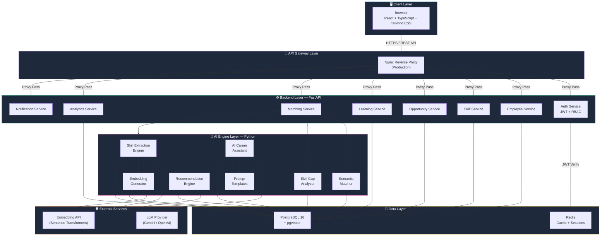
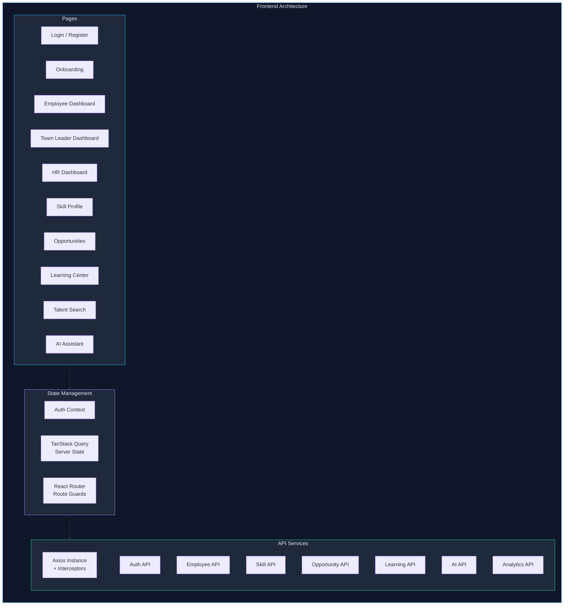
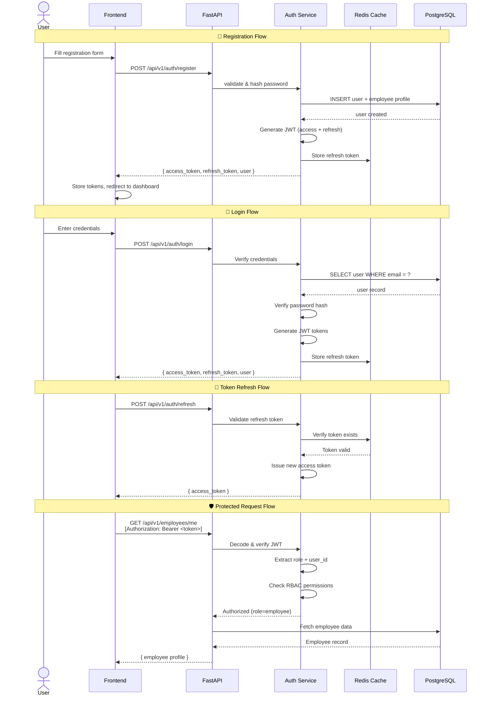
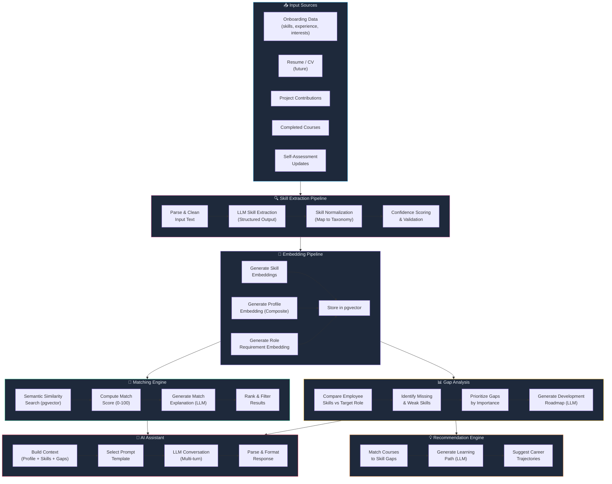
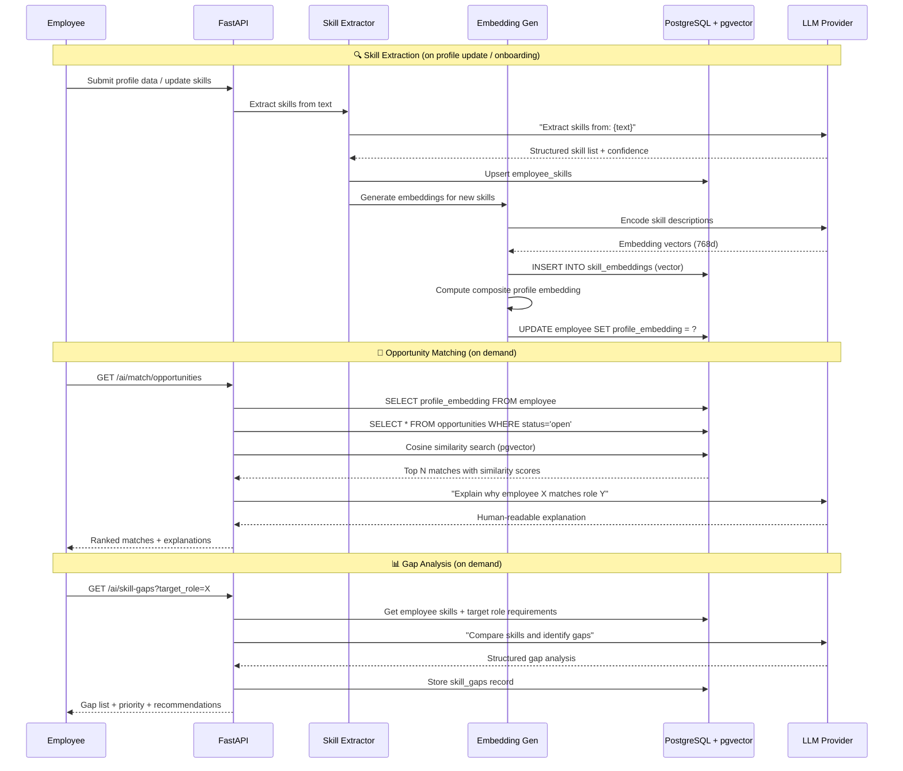
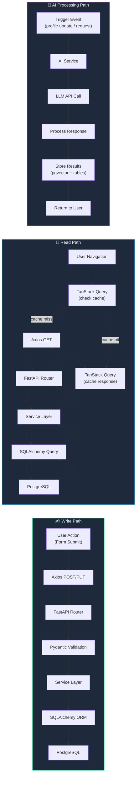
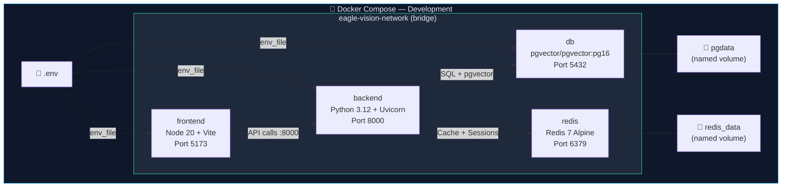
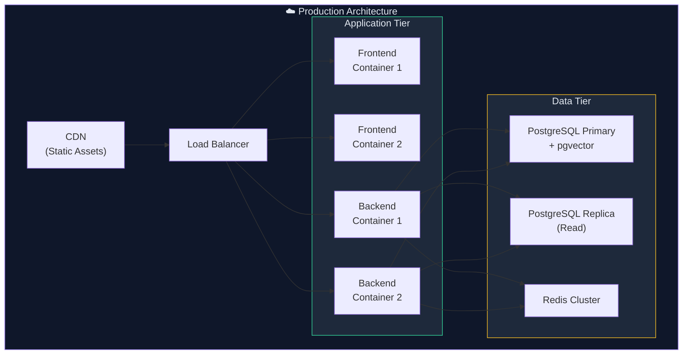
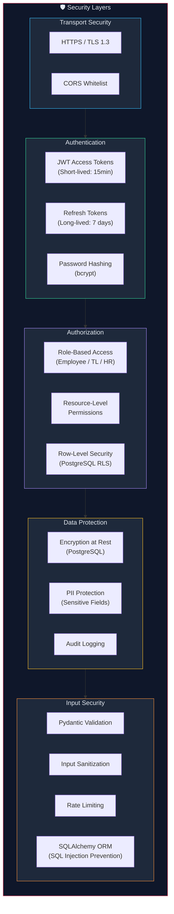

# Eagle Vision — System Architecture Design

> **Version:** 1.0  
> **Date:** 2026-09-19  
> **Status:** Draft — Pending Team Review

---

## 1. High-Level System Architecture

---

## 2. Core Component Breakdown

### 2.1 Frontend (React + TypeScript)

### 2.2 Backend Services (FastAPI)

```mermaid
graph TB
    subgraph FASTAPI["FastAPI Application"]
        direction TB
        MAIN["main.py<br/>App Factory"]

        subgraph MIDDLEWARE["Middleware"]
            CORS["CORS"]
            AUTH_MW["JWT Auth Middleware"]
            RATE["Rate Limiter"]
            LOG["Request Logger"]
        end

        subgraph ROUTERS["API v1 Routers"]
            R_AUTH["auth_router"]
            R_EMP["employee_router"]
            R_SKILL["skill_router"]
            R_OPP["opportunity_router"]
            R_LEARN["learning_router"]
            R_MATCH["matching_router"]
            R_AI["ai_router"]
            R_HR["analytics_router"]
            R_TL["talent_router"]
        end

        subgraph SVC["Service Layer"]
            S_AUTH["AuthService"]
            S_EMP["EmployeeService"]
            S_SKILL["SkillService"]
            S_OPP["OpportunityService"]
            S_LEARN["LearningService"]
            S_MATCH["MatchingService"]
            S_AI["AIService"]
            S_HR["AnalyticsService"]
        end

        subgraph REPO["Repository Layer"]
            REPO_BASE["BaseRepository<br/>(CRUD)"]
            REPO_EMP["EmployeeRepo"]
            REPO_SKILL["SkillRepo"]
            REPO_OPP["OpportunityRepo"]
            REPO_LEARN["LearningRepo"]
        end

        subgraph MODELS["SQLAlchemy Models"]
            M_USER["User"]
            M_EMP["Employee"]
            M_SKILL["Skill"]
            M_OPP["Opportunity"]
            M_COURSE["Course"]
            M_MATCH["MatchScore"]
        end
    end

    MAIN --> MIDDLEWARE
    MIDDLEWARE --> ROUTERS
    ROUTERS --> SVC
    SVC --> REPO
    REPO --> MODELS

    style FASTAPI fill:#0f172a,stroke:#34d399,color:#e2e8f0
    style MIDDLEWARE fill:#1e293b,stroke:#fbbf24,color:#e2e8f0
    style ROUTERS fill:#1e293b,stroke:#34d399,color:#e2e8f0
    style SVC fill:#1e293b,stroke:#a78bfa,color:#e2e8f0
    style REPO fill:#1e293b,stroke:#f472b6,color:#e2e8f0
    style MODELS fill:#1e293b,stroke:#fb923c,color:#e2e8f0
```

---

## 3. Authentication & Authorization Flow

### Role-Based Access Control (RBAC) Matrix

| Resource | Employee | Team Leader | HR / Talent Manager |
|---|:---:|:---:|:---:|
| Own Profile (R/W) | ✅ | ✅ | ✅ |
| Other Profiles (R) | ❌ | ✅ (team) | ✅ (all) |
| Own Skill Profile | ✅ | ✅ | ✅ |
| Talent Search | ❌ | ✅ | ✅ |
| Create Opportunities | ❌ | ✅ | ✅ |
| Apply to Opportunities | ✅ | ❌ | ❌ |
| View Applications | ❌ | ✅ (own opps) | ✅ (all) |
| Shortlist Talent | ❌ | ✅ | ✅ |
| Approve Courses | ❌ | ✅ (team) | ✅ (all) |
| Workforce Analytics | ❌ | ❌ | ✅ |
| AI Career Assistant | ✅ | ❌ | ❌ |
| AI Talent Assistant | ❌ | ❌ | ✅ |
| Manage Skills Catalog | ❌ | ❌ | ✅ |
| Manage Departments | ❌ | ❌ | ✅ |

---

## 4. AI Pipeline Architecture

### AI Pipeline Data Flow (Detailed)

---

## 5. Data Flow Architecture

---

## 6. Deployment Architecture

### Development (Docker Compose)

### Production (Future)

---

## 7. Security Architecture

---

## 8. Error Handling Strategy

| Layer | Strategy | Details |
|---|---|---|
| Frontend | Global error boundary + toast notifications | React Error Boundary, Axios interceptors for 401/403/500 |
| API Router | HTTPException with standard error schema | `{ detail, status_code, error_code }` |
| Service | Custom exception classes | `NotFoundException`, `ForbiddenException`, `ValidationException` |
| Database | SQLAlchemy exception handling | Constraint violations → friendly messages |
| AI | Retry with exponential backoff | LLM timeouts, rate limits, fallback responses |
| External | Circuit breaker pattern | Graceful degradation when LLM provider is down |

---

## 9. Monitoring & Observability (Future)

| Aspect | Tool | Purpose |
|---|---|---|
| Application Logs | Structured JSON logging (Python `structlog`) | Request tracing, error diagnosis |
| Metrics | Prometheus + Grafana | API latency, throughput, error rates |
| Health Checks | FastAPI `/health` endpoint | Container orchestration readiness/liveness |
| DB Monitoring | pg_stat_statements | Query performance |
| AI Monitoring | Custom metrics | LLM latency, token usage, cost tracking |
